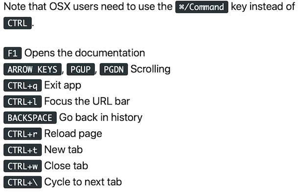

# Module 06 - Orchestrateur - Kubernetes

Ce module a pour but de vous faire explorer et découvrir Kubernetes.

## Pre-requis - Activer kubernetes dans docker desktop

- Allez dans la configuration de Docker Desktop
- Sélectionnez l'option kubernetes, cochez `Enable Kubernetes` et faites `Apply and restart`

## Exercice 1 - Exploration

- Affichez les noeuds de votre cluster
- Affichez l'ensemble de namespaces de votre cluster
- Affichez l'ensemble des pods de votre cluster en y incluant tous les namespaces
- Réessayez les commandes précédentes en demandant un affichage plus complet avec un `-o wide`. Quelles informations obtenez-vous en plus ?
- Réessayez les commandes en spécifiant non plus une sortie étendue, mais `json`, puis `yaml`
- Affichez le contexte dans lequel vous êtes en faisant un ```kubectl config view```
- Affichez la liste des contextes avec un `kubectl config get-contexts`
- Affichez le contexte courant avec un `kubectl config current-context`
- Listez vos pods et choisissez en un dans la liste. Repérez le nom et le namespace :
  - Faites un "get pod" suivi du nom du pod suivi de `--namespace=<nom du namespace>`
  - Modifiez l'affichage pour extraire les données avec le format `yaml` et redirigez la sortie vers un fichier nommé `exempleExtractionPod.yml`
  - Ouvrez ce fichier et faite-en une première lecture; nous reviendrons sur ce genre de fichiers par la suite

## Exercice 2 - Premier déploiement

Dans cet exercice, validez tout le temps que vous êtes bien dans le pod en listant, par exemple, des interfaces réseau. Vous noterez aussi que le prompt du shell est différent de celui de Powershell.

- Utilisez la commande `run` de `kubectl` afin de démarrer une image BusyBox :
  - Appelez votre exécution (~ pods) `monbash`
  - Redirigez stdin et utilisez le tty avec l'option `-it`
  - Dans le conteneur, exécutez la commande `sh` sans argument en la passant après le séparateur de paramètres du kubectl et du pod (" -- ")
- Tapez quelques commandes afin de valider que vous êtes bien dans votre pod et sortez du pod
- Notez la commande qui vous est suggérée
- Listez les pods. Qu'observez-vous ?
- Retournez dans votre pod avec la commande `attach` précédemment fournie lorsque vous êtes sorti du conteneur
- Sortez du pod
- Écrivez une commande qui permet d'exécuter la commande `sh` en mode interactif dans le pod précédent et sortez du pod
- Supprimez votre précédent déploiement avec la commande `kubectl delete deployments monbash`
- Validez que le pod est bien en train d'être supprimé en listant les pods : notez l'idée que l'orchestrateur essaie de répondre à vos commandes avec une certaine latence

<details>
  <summary>Solution</summary>

  ```bash
  kubectl run monbash --image=busybox -it -- sh
  kubectl get pods -o wide
  kubectl attach monbash-78c9b77fb9-wb27p -c monbash -i -t
  kubectl exec monbash-78c9b77fb9-wb27p -it -- sh
  ```
</details>

## Exercice 3 - Nginx

### Exercice 3.1 - Nginx - Premier déploiement

- Créez un déploiement nommé "nginx" avec la commande : ```kubectl create deployment nginx --image=nginx```. L'image expose un site sur le port 80
- Déterminez l'adresse IP du pod en utilisant les commandes que vous avez vu précédemment
- Créez une exécution nommée "navigateur" à partir de l'image `browsh/browsh` en mode interactif en ajoutant `--rm` afin de supprimer le déploiement automatique à la terminaison du pod (Le démarrage du pod est long, soyez patient !)
- Essayez d'accéder à votre site à partir de votre machine locale (votre ordinateur portable ou votre VM). Que se passe-t-il ? Pourquoi ?
- Essayez d'accéder à votre site à partir du Pod "browsh" (Ctrl-L) qui devrait normalement être lancé. Est-ce que cela fonctionne ? Pourquoi ?
- Supprimez votre déploiement

Voici les principales touches que vous pouvez utiliser dans ce navigateur en mode texte :



<details>
  <summary>Solution</summary>

  ```bash
  kubectl create deployment nginx --image=nginx
  kubectl get pods -o wide # récupération de l'adresse IP du Pod.
  kubectl run navigateur --image=browsh/browsh -it --rm
  kubectl delete deployment nginx
  ```
</details>

### Exercice 3.2 - Nginx - Liaison d'un port

- Créez un déploiement nommé `whoami` avec l'image `traefik/whoami`
- Validez que le pod est bien créé en visualisant le pod et le déploiement
- Créez de nouveau replica de votre pod en tapant la commande suivante : ```kubectl scale deployment --replicas 10 whoami```
- Listez les pods et validez que vous en avez bien 10 maintenant
- Exposez vos pods sur votre hôte local avec la commande suivante : ```kubectl expose deployments whoami --port=80 --type=LoadBalancer```
- Testez votre site en local
- Testez plusieurs fois la commande suivante `wget -qO - http://127.0.0.1` (si la commande ne fonctionne pas, installez wget ou utilisez une commande équivalente comme curl)
- Supprimez les ressources créées

<details>
  <summary>Solution</summary>
  
  ```bash
  kubectl create deployment whoami --image=traefik/whoami
  kubectl get pods -o wide
  kubectl get deployments -o wide
  kubectl scale deployment --replicas 10 whoami
  kubectl expose deployments whoami --port=80 --type=LoadBalancer
  kubectl delete services whoami
  kubectl delete deployment whoami
  ```
</details>
