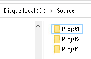
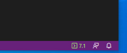

# Exercice 9 - PowerShell

**Sysèteme d'exploitation** : Windows 10 Éducation. Vous pouvez utiliser votre poste ou la vm générale.

**Documentation**:

- [Qu’est-ce que PowerShell ? - PowerShell | Microsoft Docs](https://docs.microsoft.com/fr-fr/powershell/scripting/overview?view=powershell-7.1)


## Version de Windows PowerShell

- Dans la console PowerShell, vérifiez si votre instance de PowerShell est la version Core. Sinon installer la version Core.

```PowerShell
c:\..\system32>$PSVersionTable
```
**Installation de la version PowerShell Core**
- La version PowerShell Core est disponible sur GitHub à l'adresse : [https://github.com/PowerShell/PowerShell/](https://github.com/PowerShell/PowerShell/)
- Dans la page Web, descendez jusqu'à Get PowerShell
- Sélectionnez Windows(x64) et sur la colonne Download (LTS), cliquez sur .msi
- Le fichier PowerShel-[Version]-win-x64.msi devrait être proposé pour l'enregistrement
- Enregistrez le fichier à un emplacement de votre choix. Par exemple Téléchargement.
Après l'enregistrement, procédez à son installation.
- À l'avenir, vous devrez taper la commande ***pwsh*** pour lancer PowerShell Core,  et choisir run as administrator.

**Vos premières commandes**
- Comme première pratique avec PowerShell, exécuter les commandes du cours PowerShell  présentes dans le dépôt GitHub suivant :
[Commandes PowerShell](https://github.com/jpduchesneauCegep/420-W44-SF-4391/blob/master/Module06_Scripts/CmdPowerShellCoursTheorique.md)

**Manipulation des dossiers et fichiers**

- Pour savoir où vous vous situez, utiliser la commande Get-Location
- Créer la structure suivante à l'aide des commandes PowerShell.

- Pour y arriver, vous avez probablement taper quatre fois la commande New-Item comme dans la figure suivante : 


# PowerShell Script

## Utilisation de Visual Studio Code pour PowerShell

Comme nous l'avons précisé dans le cours, Microsoft a presque arrêté de développer PowerShell ISE et recommande d'utiliser à la place un outil plus puissant, pratique, flexible et gratuit - Visual Studio Code (VS Code); de plus, Visual Studio Code est multiplate-forme donc est aussi disponible sur Mac et Linux et intègre le système de gestion de code Git.	
Visual Studio Code est déjà présent sur votre machine virtuelle, par contre, il n'a pas été paramétré pour travailler avec PowerShell.

- Ouvrez visual studio code
- A gauche, sélectionnez  l'icône des extensions
- Dans la nouvelle fenêtre, vous avez un champs "Search Extensions in Markatplace". Tapez ***PowerShell*** dans ce champs.
- Cliquez install sur l'extension PowerShell.
- Au besoins, procédez à l'installation de la mise à jour de PowerShell en cliquant Next et en suivant les étapes. Vous utilisez les paramètres par défaut qui vous sont proposées pour l'installation de la mise à jour.
- Vous devriez avoir la version 7.1 affichée en bas  à droite de Visual Studio Code: 



- Pour le rendre plus pratique, vous pouvez configurer les paramètres d'interface VSCode suivants (une icône d'engrenage dans le coin inférieur gauche) à Color Theme = PowerShell ISE :


- Si vous planifiez uniquement l’utilisation de VS Code pour les scripts PowerShell, vous pouvez masquer la Console de débogage, car elle n’est pas utilisée par l’extension PowerShell. Pour ce faire, cliquez avec le bouton droit sur Console de débogage puis cliquez sur la coche pour la masquer.
- Il est possible que VS Code vous propose des mises à jour en bas à droite sur l'icône d'engrenage. N'hésitez pas à faire ces mises à jour.
- 	Pour en savoir d'avantage sur l'utilisation de PowerShell dans VS Code, je vous invite à lire :[https://docs.microsoft.com/fr-fr/powershell/scripting/dev-cross-plat/vscode/how-to-replicate-the-ise-experience-in-vscode?view=powershell-7.1]
	
**Passer des one-liners PowerShell aux scripts**
 Celà est bien plus simple que ça n’en a l’air. Un script n’est rien de plus qu’un ensemble de commandes identiques ou similaires que vous exécutez de manière interactive dans la console PowerShell, sauf que ces commandes sont enregistrées dans un fichier .PS1

- Cliquez sur Ctrl+N, ou file --> New File pour créer un nouveau fichier.
- Sauvegarder ce fichier avec l'extension .ps1 à l'emplacement de votre choix.

Attention l'extension permet à VisualStudio de reconnaitre le langage de programmation utilisé et de ce fait, d'utiliser la bonne extension. Donc, c'est une bonne habitude de toujours nommer vos fichiers avant de débuter

- Vous devriez maitenant avoir l'affichage de la figure \ref{Fig6} avec votre fichier en haut et le terminal PowerShell en bas.
- Vous avez tous ce qu'il faut pour travailler.
- Taper une commande simple pour afficher la liste des processus en cours d'exécutions : Get-Process
    - Vous pouvez la taper directement dans le terminal.
	-  Ou encore, la taper dans votre script en haut et le sélectionnez et taper F8.
	- Testez les deux façons. Elles vous donnent le même résultat.
	- Bien sûr, ce qui nous intéresse c'est d'écrire des Scripts; donc, d'écrire dans la partie du haut du code, des variables, des structures de contrôles, des fonctions, etc. qui vous permettront de gagner en temps et en possibilités.
	
- Tapez le code suivant : 
 ```PowerShell
	# Mon premier script
		# Version 1.0
		# [Votre nom]
		# DATE
		
		# Déclaration de variables :
		$date= Get-Date
		$nomPC = Get-Content env:COMPUTERNAME
		$ligne="------------------------------------------------------------------"
		$ligneDouble ="================================================================"
		
		# Programme :
		Clear-Host
		Write-Host $ligneDouble
		Write-Host "Exécution du Scprit le $($date)"
		Write-Host $ligne
		Write-Output "Le nom de l'ordinateur est : $($nomPC)"
		Write-Host $ligne
		Get-CimInstance -Query 'Select * from Win32_BIOS'
		Write-Host $ligne
		Write-Output "Adresses IPv4"
		Get-NetIPAddress -AddressFamily IPv4 | Sort-Object -Property InterfaceIndex | Format-Table 
		Write-Host $ligneDouble
```
- Pour comprendre Get-Instance vous pouvez lire :  [https://docs.microsoft.com/fr-fr/powershell/scripting/learn/ps101/07-working-with-wmi?view=powershell-7.1]
- Dans le terminal, déplacez-vous dans le répertoire de votre script et exécutez-le.

```PowerShell
    set-location c:\Users\jpduches\Documents\PowerShell\Script
    .\MonPremierScript.ps1
```

## Autoriser l'exécution de scripts

Par défaut, PowerShell est configuré en mode "Restricted". Nous allons le basculer en mode "Unrestricted" pour faciliter sa prise en main.

Il est possible d'indiquer à PowerShell plusieurs modes d'exécution. Chaque mode implique un certain comportement :
- **Restricted** : aucun script ne peut être exécuté. PowerShell est utilisable uniquement en mode interactif.
- **AllSigned** : seuls les scripts signés peuvent être exécutés.
- **RemoteSigned** : les scripts téléchargés depuis Internet doivent être signés pour être exécutés. Les scripts présents sur votre poste de travail ne sont pas concernés et peuvent être exécutés.
- **Unrestricted** : pas de restrictions. Les scripts peuvent être exécutés.
 
Bien sûr, dans un environnement de production, vous devriez utiliser le mode "AllSigned".

- Si vous souhaitez connaître le mode actuellement utilisé, lancez la cmdlet Get-ExecutionPolicy
- Pour changer de mode, il suffit d'utiliser la cmdlet Set-ExecutionPolicy [Les modes souhaités]


	À partir de maintenant, vous pouvez exécuter n'importe quel script PowerShell(.ps1)

## Création d'un usager avec PowerShell


Dans ce script, vous allez pouvoir créer un usager.
Tapez le code suivant :

```PowerShell
# Script de création d'un usager local avec les droits administrateur
		# Version 1.0
		# Auteur [Votre nom]
		# Date
		
		# Création et affectation des variables
		$nomUsager = "usager1"
		$nomComplet = "Usager test"
		$dateExpires = (get-date).AddYears(1)
		$Description = "Test avec PowerShell"
		$motPasse ="Soleil01"
		$groupe = "Administrateurs"
		
		
		New-LocalUser -Name $nomUsager -AccountExpires $dateExpires  -Description $Description -FullName $nomComplet -NoPassword
		Add-LocalGroupMember -name $groupe -Member $nomUsager
```

- Dans le terminal, déplacez-vous dans le répertoire de votre script et exécutez-le.
- Ouvrez la fenêtre "Gestion de l'ordinateur" et vérifiez la présence de l'usager créé.
- Suprimer l'usager du groupe adminisatateurs avec la commande suivante : 
```PowerShell
 Remove-LocalGroupMember -name Administrateurs -Member usager1
```
- Vérifier dans "Gestion de l'ordinateur" les modficiations apportées.
