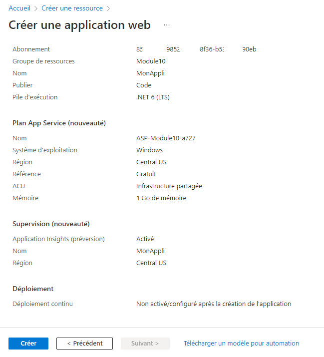

# Exercice 1 - Cloud 

## Créer une application avec le portail Azure

1. Allez sur le portail d'Azure 
2. Dans les services Azure, cliquer sur créer une ressource.
3. Sélectionnez Web App

    - Au besoin, sélectionnez votre abonnement
    - Créer un Groupe de ressources : Module10
    - Pour le nom, entrez le nom : MonAppli
    - Dans la pile d'exécution : .Net 6 (LTS)
    - Système d'exploitation : Linux

4. Cliquez sur vérifier + Créer

    - Cliquez sur l'onglet De Base en haut.
    - Modifier la taille pour Dev/Test et F1

5. Résultat avant création 

    

6. Cliquez sur Créer

    - Un message :  "Le déploiement est en cours" est présent.
    - Cliquez sur Accéder à la ressource.
    - En haut à gauche vous devriez avoir l'URL pour accéder à votre nouvelle application Web.

7. Enregistrer le fichier json

    - Dans la vue App Service vous pouvez télécharger le fichier json.
    - Cliquez sur Vue JSON
    - Copier le contenu et enregistrer le pour consultation ultérieure.

## Créer une machine virtuelle avec le portail Azure

1. Allez sur le portail d'Azure 
2. Dans les services Azure, cliquer sur créer une ressource.
3. Sélectionnez Ubuntu Server 20.04 LTS

    - Au besoin, sélectionnez votre abonnement
    - Créer un Groupe de ressources : Module10
    - Pour le nom, entrez le nom : MaVM
    - Dans la pile d'exécution : .Net 6 (LTS)
    - Système d'exploitation : Linux
    - Changer la taille pour Standard_B1ls- processeur virtuel, 0,5 Gio de mémoire (5,97 $CA/mois)
    - Changer le type d'authentification pour : Mot de passe
    - Choisir un nom d'utilisation : Exemple AdminVM
    - Choisir un mot de passe facile à retenir

4. Cliquez sur Suivant : Disques

    - Sélectionner HDD Standart
    - Modifier la taille pour Dev/Test et F1

5. Cliquez sur Créer

    - Vérifier les paramètes
    - Si toutes est ok cliquez sur Créer.
    - Si non retourné dans la configuration à partir des onglets.

6. Cliquez sur Créer

    - Un message :  "Le déploiement est en cours" est présent.
    - Cliquez sur Accéder à la ressource.
    - En haut à gauche vous devriez avoir l'URL pour accéder à 
    votre nouvelle application Web.

7. Accédez à la VM pour SSH. 
    - Utiliser un client SSH (Putty, SSH dans PowerShell ou Linx) pour vous connecter à votre nouvelle vm.
    - Naviguer dans l'arboressence.

8. Enregistrer le fichier json
    - Dans la vue App Service du portail Azure, vous pouvez télécharger le fichier json.
    - Cliquez sur Vue JSON
    - Copier le contenu et enregistrer le pour consultation.

8. Supprimer l'application : 

    - Cliquez sur  Accueil
    - Sélectionnez Module10
    - Cliquez sur Supprimer le groupe de ressources.
    - Confirmez en tapant le nom de la ressource à supprimer : Module 10.
    - Cliquez en bas sur Supprimer.

## Créer des modèles ARM avec Visual Studio Code

>[Note]
La maintrise des modèles ARM est un sujet complexe. Dans cette partie de l'exercice nous cherchons a vous faire prendre conscience de la puissance de l'IC (infrastructure as Code).

Préalable : Installer le module Azure dans votre PowerShell : [installationAzure.md](installationAzure.md)

Avant de débuter, annalysez les informations disponibles dans le menu de gauche.
[ARM template documentation](https://docs.microsoft.com/en-us/azure/azure-resource-manager/templates/)

Effectuer le laboratoire présent à l'adresse suivante : 

https://docs.microsoft.com/en-us/azure/azure-resource-manager/templates/template-tutorial-create-first-template?tabs=azure-powershell

> [!IMPORTANT]
> Puor utilisé Visual studio code, vous devez installer l'extension Azure Resource Manager. 

